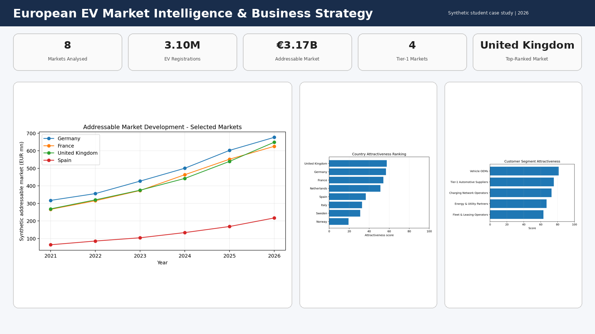
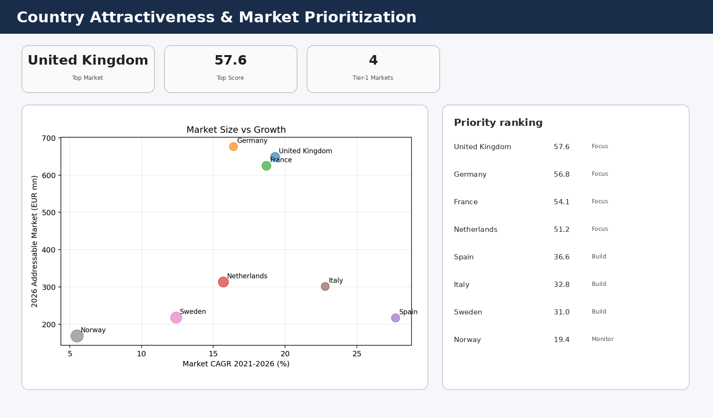
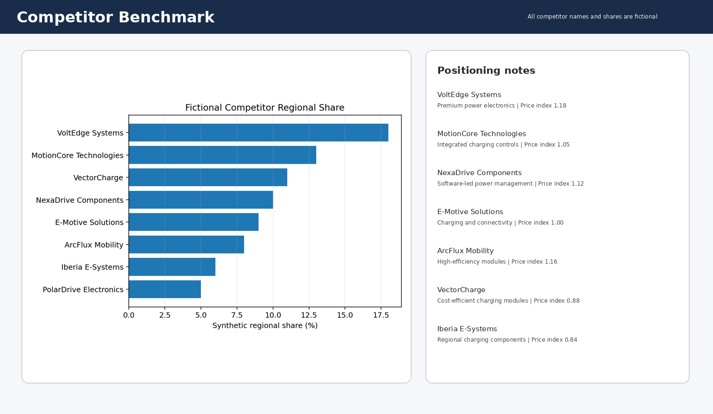
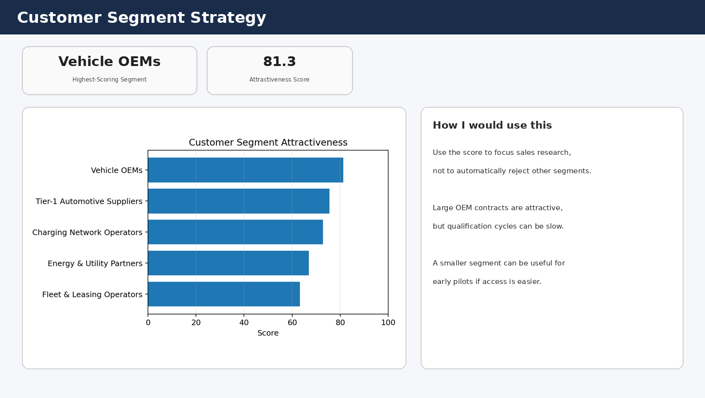
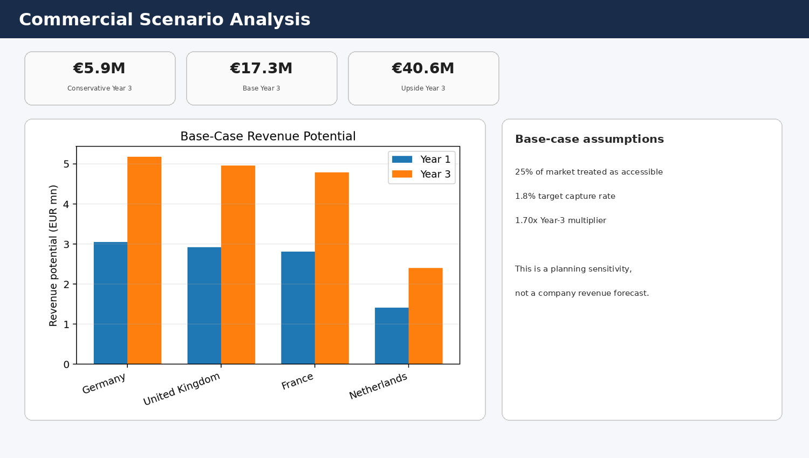
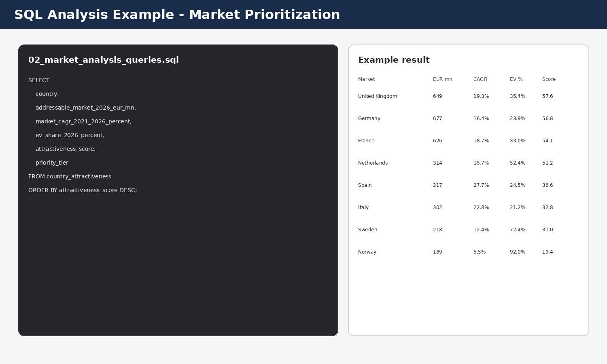

# European EV Market Intelligence & Business Strategy

> Independent student portfolio project using a fictional company and fully synthetic market data.

I built this project to practice the kind of work that appears in **Market Intelligence, Business Development, Strategy, Business Analyst and Data Analyst Working Student roles**.

The main question I wanted to answer was:

**If several European EV markets look attractive, how do you decide where a company should focus first?**

Instead of just ranking countries by size, I tried to look at the decision from different angles:

- market size
- market growth
- EV adoption
- charging infrastructure
- competition
- commercial practicality
- customer segments
- revenue scenarios

The fictional company in the case study is **Aster Mobility Systems GmbH**, a German B2B mobility-tech company assumed to sell EV power-electronics and charging-control components.

---

## Project at a glance

- **8 European markets**
- **2021-2026** synthetic market history
- **EUR 3.17B** estimated 2026 addressable market across the eight countries
- **4 Tier-1 priority markets**
- **8 fictional competitors** benchmarked
- **5 customer segments** assessed
- **3 revenue scenarios** for the top four markets
- **United Kingdom** is the highest-ranked market in the scoring model



---

# The business problem

Aster Mobility Systems GmbH wants to expand its European commercial presence.

The obvious answer would be to target the biggest countries first.

But I wanted to test a more realistic question:

**Is the biggest market always the best market to enter first?**

A country might have a large EV market but also:

- strong competition
- mature customers with existing suppliers
- difficult sales access
- slower growth

Another country might be smaller today but:

- growing faster
- easier to access
- less crowded
- more suitable for pilot customers

So I built a simple market-intelligence framework instead of using only one KPI.

---

# 1. Market history

The first dataset covers eight European countries:

- Germany
- France
- United Kingdom
- Netherlands
- Norway
- Sweden
- Italy
- Spain

For each country, the synthetic 2021-2026 history includes:

- EV registrations
- total car registrations
- EV share
- public charging points
- charging-point density
- estimated addressable B2B market
- commercial ease
- competition intensity
- relative market price index

**File:** `data/01_market_history.csv`

I intentionally created different market profiles.

For example, some countries are more mature in EV adoption while others have stronger growth headroom.

---

# 2. Market growth

I calculated market growth using CAGR:

`CAGR = (Market 2026 / Market 2021)^(1/5) - 1`

This gave me a way to compare a mature market with a fast-growing one.

A country that is already large can still grow slowly, while a smaller country can have much stronger momentum.

That difference became important later in the country-prioritization model.

---

# 3. Country attractiveness model

I created a weighted score using six dimensions.

| Dimension | Weight |
|---|---:|
| Market Size | 30% |
| Market Growth | 20% |
| EV Adoption | 15% |
| Charging Infrastructure | 10% |
| Commercial Ease | 15% |
| Competition Advantage | 10% |

The individual inputs are normalized across the eight countries before the weighted score is calculated.

I gave market size the highest weight, but I deliberately did **not** let it completely dominate the result.



The four Tier-1 markets in the synthetic model are:

1. **United Kingdom** - score 57.6
2. **Germany** - score 56.8
3. **France** - score 54.1
4. **Netherlands** - score 51.2

The highest-ranked market is:

**United Kingdom - 57.6/100**

One thing I would not do in a real project is treat this number as a precise answer.

The score is useful because it makes the assumptions visible. If a sales manager thinks commercial access matters more, the weights can be changed and the ranking can be challenged.

That is how I would actually want the model to be used.

---

# 4. Competitor benchmark

I also wanted to include competitor analysis.

Instead of inventing market-share numbers for real companies, I created **fictional competitors**.

That allowed me to practice the analysis without making misleading claims.

The competitor benchmark compares:

- product breadth
- technical differentiation
- customer coverage
- relative pricing
- synthetic regional share
- strategic positioning



The fictional competitor set includes different types of players:

- broad premium suppliers
- technically differentiated specialists
- regional lower-cost competitors
- charging-focused players

This made it easier to think about a possible positioning gap.

For example:

> Should Aster compete mainly on price, technical performance, product breadth or customer support?

The project does not pretend to answer that perfectly, but it gives the discussion some structure.

---

# 5. Customer segment strategy

I then looked at who the company should actually sell to.

The five synthetic customer segments are:

- Vehicle OEMs
- Tier-1 Automotive Suppliers
- Charging Network Operators
- Fleet & Leasing Operators
- Energy & Utility Partners

Each segment is scored using:

- opportunity size
- growth outlook
- sales-cycle ease
- strategic fit
- margin potential
- competition intensity



The highest-scoring segment in the model is:

**Vehicle OEMs**

I found this part useful because the largest customer segment is not always the easiest first customer.

For example, OEM contracts can be very attractive, but qualification and sales cycles can also be long.

A smaller segment might be more useful for proving the product and building references first.

---

# 6. Revenue scenario analysis

I created three commercial planning scenarios for the top four countries.

### Conservative

- 18% accessible market
- 1.0% target capture rate
- 1.45× Year-3 multiplier

### Base

- 25% accessible market
- 1.8% target capture rate
- 1.70× Year-3 multiplier

### Upside

- 32% accessible market
- 2.8% target capture rate
- 2.00× Year-3 multiplier



The combined Year-3 potential across the four priority markets is approximately:

- **EUR 5.9M** - Conservative
- **EUR 17.3M** - Base
- **EUR 40.6M** - Upside

These numbers are **not forecasts**.

They are a simple sensitivity exercise so I could see how much the answer changes when accessible market and capture assumptions change.

That was the main reason I included three scenarios instead of one single revenue number.

---

# 7. Strategy recommendation

My recommendation is not to enter all eight markets at once.

I would start validation work in:

**United Kingdom and Germany**

Then use the remaining Tier-1 markets as the next expansion candidates.

The suggested 12-month roadmap is split into three stages.

## Phase 1 - Validate

0-3 months

- customer interviews
- competitor tracking
- pricing validation
- commercial assumptions

## Phase 2 - Pilot

3-6 months

- two customer pilots
- local channel/partner assessment
- product and certification gap review

## Phase 3 - Scale

6-12 months

- named-account plan
- qualified commercial pipeline
- expand only if pilot and pipeline thresholds are met

**File:** `data/06_strategy_roadmap.csv`

I liked this structure because it connects market research with an actual next action.

---

# SQL analysis

I also included SQL because market-intelligence work often involves pulling and comparing market data rather than only using PowerPoint.

The SQL queries answer questions such as:

- Which countries grew fastest?
- Which markets combine size and growth?
- Which countries have lower EV penetration but meaningful market size?
- Which competitors have the largest synthetic share?
- Which customer segments rank highest?
- What is the Base-case revenue potential?
- How wide is the revenue scenario range?



### SQL files

`sql/01_schema.sql`

Creates the SQLite-compatible tables.

`sql/02_market_analysis_queries.sql`

Contains the business-analysis queries.

I kept the queries readable because I wanted the SQL to look like something I could genuinely explain during an interview.

---

# Excel analysis workbook

The main workbook is:

`analysis/European_EV_Market_Intelligence.xlsx`

It contains:

- `START_HERE`
- `Market_History`
- `Country_Scoring`
- `Competitors`
- `Customer_Segments`
- `Revenue_Scenarios`
- `Strategy_Roadmap`
- `Executive_Dashboard`

Important parts of the workbook are formula-driven.

For example:

- the final country attractiveness score
- priority tier
- customer-segment score
- Year-1 revenue scenario
- Year-3 revenue scenario

This makes it easier to change an assumption and see what happens.

---

# Data files

| File | Purpose |
|---|---|
| `01_market_history.csv` | 2021-2026 synthetic EV and market history |
| `02_country_attractiveness.csv` | Country scores and priority tiers |
| `03_competitor_benchmark.csv` | Fictional competitor positioning data |
| `04_customer_segments.csv` | Customer segment opportunity and scoring |
| `05_revenue_scenarios.csv` | Conservative, Base and Upside commercial cases |
| `06_strategy_roadmap.csv` | 12-month validation, pilot and scale plan |

---

# Documentation

### `docs/Business_Questions.md`

The questions I used to structure the analysis.

### `docs/Methodology.md`

Explains the synthetic market model, scoring logic and revenue assumptions.

### `docs/KPI_Dictionary.md`

Simple definitions of the main market-intelligence KPIs.

### `docs/Strategy_Recommendation.md`

The final market-entry recommendation and reasoning.

### `docs/EV_Market_Intelligence_Executive_Summary.pdf`

A short visual summary of the project.

---

# Skills demonstrated

### Market Intelligence

- market sizing
- growth analysis
- country comparison
- competitor benchmarking
- customer segmentation

### Business Strategy

- market prioritization
- weighted decision models
- go-to-market thinking
- revenue scenarios
- strategic roadmap

### Data Analytics

- Excel modelling
- SQL analysis
- normalization
- CAGR
- scenario analysis
- KPI comparison
- data visualization

### Business Analysis

- turning a broad business problem into measurable criteria
- making assumptions visible
- comparing trade-offs
- translating analysis into recommendations

---

# What I learned

The biggest lesson for me was that **market size and strategic priority are not the same thing**.

Before doing the scoring, I expected the largest market to automatically rank first.

Once I added growth, adoption, competition and commercial ease, the decision became less obvious.

I also learned that a scoring model should not hide the judgement behind it.

The weights are assumptions.

That means somebody else should be able to say:

> “I disagree with this weight.”

and then test what happens when it changes.

For me, that makes the model more useful than just presenting one ranking as if it were objectively correct.

Another useful part was the revenue scenario analysis.

Using Conservative, Base and Upside cases made it much clearer how dependent the answer is on assumptions such as accessible share and capture rate.

---

# Limitations

This is an independent educational portfolio project.

- **Aster Mobility Systems GmbH is fictional.**
- All market values and EV data are synthetic.
- All competitor names are fictional.
- Competitor shares are synthetic.
- Country scores are judgement-based.
- Revenue scenarios are illustrative and are not financial forecasts.
- No real customer interviews were performed.
- Regulations, certification requirements and local sales structures are simplified.
- The project does not represent real consulting work or investment advice.

The goal is to practice market-intelligence, analytics and strategy in a way that I can explain clearly during Working Student and internship interviews.

---

# Repository structure

```text
european-ev-market-intelligence/
├── README.md
├── analysis/
│   ├── European_EV_Market_Intelligence.xlsx
│   └── ev_market_intelligence.sqlite
├── data/
│   ├── 01_market_history.csv
│   ├── 02_country_attractiveness.csv
│   ├── 03_competitor_benchmark.csv
│   ├── 04_customer_segments.csv
│   ├── 05_revenue_scenarios.csv
│   └── 06_strategy_roadmap.csv
├── sql/
│   ├── README.md
│   ├── 01_schema.sql
│   └── 02_market_analysis_queries.sql
├── docs/
│   ├── Business_Questions.md
│   ├── Methodology.md
│   ├── KPI_Dictionary.md
│   ├── Strategy_Recommendation.md
│   └── EV_Market_Intelligence_Executive_Summary.pdf
└── screenshots/
    ├── 01_executive_market_overview.png
    ├── 02_country_attractiveness.png
    ├── 03_competitor_benchmark.png
    ├── 04_customer_segment_strategy.png
    ├── 05_revenue_scenarios.png
    └── 06_sql_market_analysis.png
```

---

**Note:** I created this as a student portfolio project to practice market intelligence, business strategy, SQL and data analytics without presenting synthetic assumptions as real company results.
